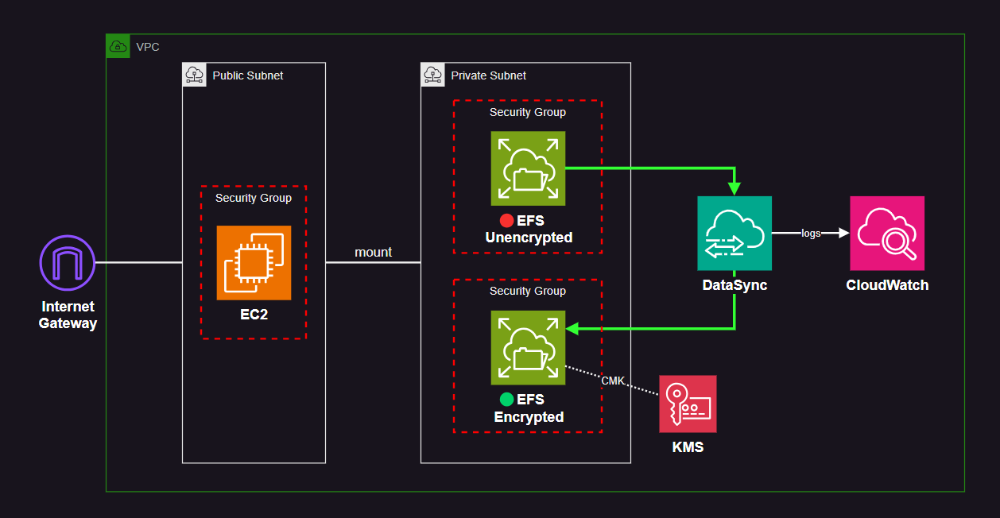

# AWS EFS Datasync

AWS EFS migration using DataSync and KMS.

A few notes about EFS encryption:

- **Encrypting file data at rest** - You can use:
  - AWS managed key (default) for Amazon EFS `aws/elasticfilesystem`.
  - A KMS CMK that you manage.
- **EFS encryption** - It is not possible to encrypt an existing EFS. You have to migrate the data to a new encrypted EFS.
- **Encrypting metadata at rest** - Amazon EFS uses the AWS managed key for Amazon EFS, `aws/elasticfilesystem`, to encrypt and decrypt file system metadata (that is, file names, directory names, and directory contents).



## Setup

Create the infrastructure:

```sh
terraform init
terraform apply -auto-approve
```

Both file shares will be [mounted][1] upon `user-data` execution. Example:

```sh
mkdir ~/efs-mount-point
sudo mount -t nfs -o nfsvers=4.1,rsize=1048576,wsize=1048576,hard,timeo=600,retrans=2,noresvport <<MOUNT-TARGET-DNS>>:/   ~/efs-mount-point
```

Permissions to add files is already granted by user data, if not, do it manually:

```sh
cd ~/efs-mount-point
sudo chmod go+rw .
```

Create as many test files as needed.


## Trigger DataSync

An AWS DataSync task will be created as part of the infrastructure.

Trigger the task from the CLI:

```sh
aws datasync start-task-execution --task-arn <arn>
```

Use the console to monitor the execution and check CloudWatch logs for troubleshooting.

[1]: https://docs.aws.amazon.com/efs/latest/ug/wt1-test.html
